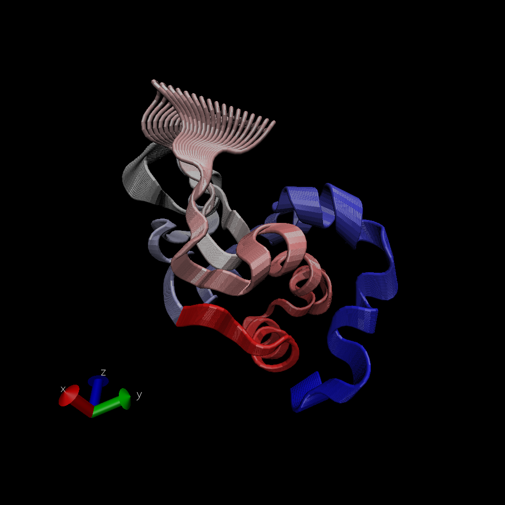

# working with bio3d
```{r}
library(bio3d)
pdb<-read.pdb("1hel")
pdb
```

```{r}
head(pdb$atom)
```
#a quick bioinformatics prediction of protein dynamics (flexibility). we use the `nma()` function, which does normal mode analysis
```{r}
modes <-nma(pdb)
plot(modes)
```

#Make a trajectory of this prediction with the `mktrj()` 

```{r}
mktrj(modes,file="nma.pdb")
```




#Comparative structural analysis 
```{r}
aa<-get.seq("1AKE_A")
aa
```
```{r}
blast<-blast.pdb(aa)
hits<-plot(blast)
```
```{r}
hits$pdb.id
files <- get.pdb(hits$pdb.id,path="pdbs",split=TRUE,gzip=TRUE)
```

#align all the structures 
```{r}
pdbs <- pdbaln(files,fit=TRUE)
```

#Let's have a wee look
```{r}
pdbs
```
```{r}
pdbs$xyz
```

#PCA analysis
```{r}
pc<-pca(pdbs)
plot(pc)
mktrj(pc,pc=1,file="pca.pdb")
```

