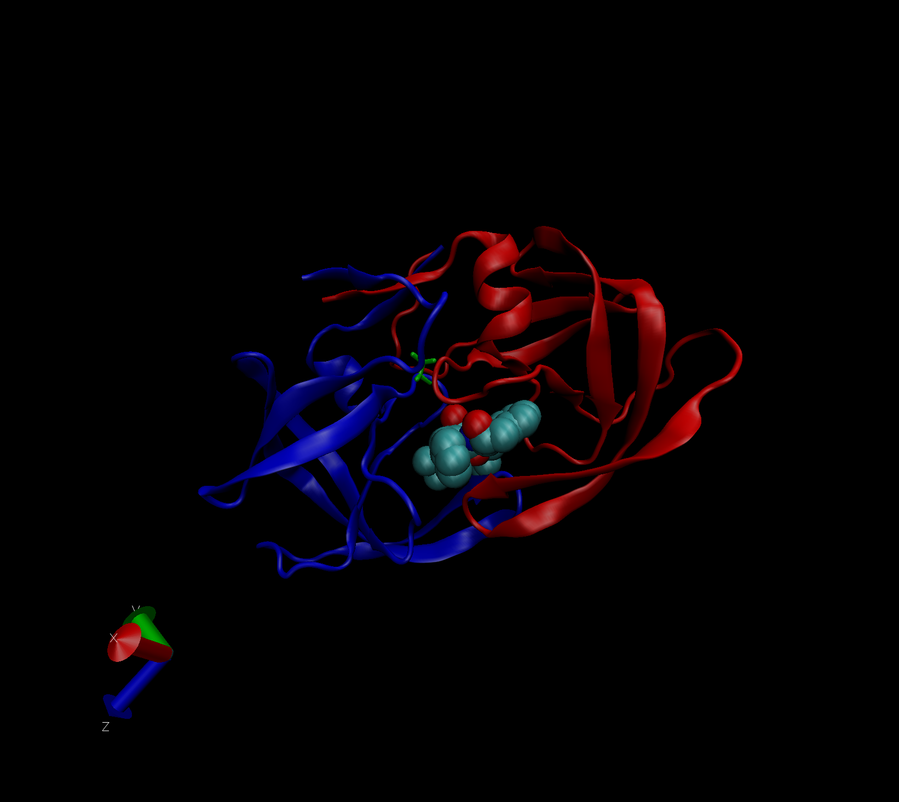

#The PDB dataset
## Q1: What percentage of structures in the PDB are solved by X-Ray and Electron Microscopy.
87.53% of the structures in the PDB are solved by X-ray and 4.95% of the structures are solved by EM.
```{r setup, include=FALSE}
db = read.csv("Data Export Summary.csv" , row.names = 1)
head(db)
Xraypercent = round((sum(db$X.ray)/sum(data$Total))*100,2)
EMpercent = round((sum(db$EM)/sum(data$Total))*100,2)
```
###how about doing this over every method?
```{r}
round((colSums(db) / sum(db$Total) *100),2)
```
## Q2: What proportion of structures in the PDB are protein?
87.35% are protein
```{r}
propercent = round((sum(db$Total[1])/sum(db$Total))*100,2)
```

## Q3: Type HIV in the PDB website search box on the home page and determine how many HIV-1 protease structures are in the current PDB?
 4411 structures for searching HIV only 

## The PDB format 

## Q4: Water molecules normally have 3 atoms. Why do we see just one atom per water molecule in this structure?
Since the whole water molecule is labeled as different atoms

## Q5: There is a conserved water molecule in the binding site. Can you identify this water molecule? What residue number does this water molecule have (see note below)?
residue 308

##Q6: As you have hopefully observed HIV protease is a homodimer (i.e. it is composed of two identical chains). With the aid of the graphic display and the sequence viewer extension can you identify secondary structure elements that are likely to only form in the dimer rather than the monomer?


#Using Bio3D in R for structural bioinformatics 
```{r}
library(bio3d)
pdb<-read.pdb("1hsg")
pdb
head(pdb$atom)
m <- nma(pdb)
plot(m)
```
#Make a little movie(trajecotry) for viewing in VMD 
```{r}
mktrj(m,file="nma.pdb")
```


##Q7: How many amino acid residues are there in this pdb object? 

##Q8: Name one of the two non-protein residues? 

##Q9: How many protein chains are in this structure? 

