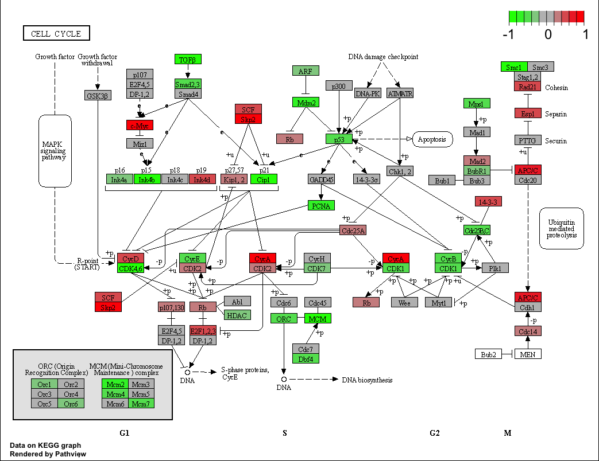

```{r}
#install.packages("BiocManager")
#BiocManager::install()
#BiocManager::install("DESeq2")
library(BiocManager)
library(DESeq2)
```
#input the data for RNAseq
```{r}
counts <- read.csv("airway_scaledcounts.csv", row.names=1)
metadata <-  read.csv("airway_metadata.csv")
head(counts)
head(metadata)
```
#Check the correspondence of the metadata and count data
```{r}
colnames(counts) == metadata$id
all(colnames(counts)==metadata$id) #check whether they are matched 
```


#Q1. How many genes are in this dataset? 
38694
```{r}
nrow(counts)
```
#Q2. How many ‘control’ cell lines do we have? 
4 
```{r}
length(which(metadata$dex=="control"))
```
#Compare control to treated 
first we need to access all the control columns in our counts data.
```{r}
control.inds <- metadata$dex=="control"
control.ids<-metadata[control.inds,]$id
metadata$dex=="treated"
```
#Use the ids to access just the control fcolumns of our 'counts' data
```{r}
head(counts[,control.ids])
control.mean<-rowMeans(counts[,control.ids])
head(control.mean)
```

#Do the same for the drug treated
```{r}
treated.inds <- metadata$dex=="treated"
treated.ids<-metadata[treated.inds,]$id
head(counts[,treated.ids])
treated.mean<-rowMeans(counts[,treated.ids])
head(treated.mean)
```
#combine our meancount data for bookkeeping 
```{r}
meancounts <- data.frame(control.mean,treated.mean)
nrow(counts)
```
#compare the control and treated
#Q5 (a). Create a scatter plot showing the mean of the treated samples against the mean of the control samples. Your plot should look something like the following.
#Q5 (b).You could also use the ggplot2 package to make this figure producing the plot below. What geom_?() function would you use for this plot? 
#Q6. Try plotting both axes on a log scale. What is the argument to plot() that allows you to do this? 

a quick plot of our progress so far
```{r}
plot(meancounts)
#this would benefit from a single log transform from a plot
plot(meancounts,log="xy")
meancounts$log2fc <- log2(meancounts[,"treated.mean"]/meancounts[,"control.mean"])
head(meancounts)
```
#we need to drop the zero count genes/rows 
#Q7. What is the purpose of the arr.ind argument in the which() function call above? Why would we then take the first column of the output and need to call the unique() function?
arr.ind is a logical statement that judge whether should array indices be returned when x is an array. Calling unique() will ensure we dont count any row twice.

```{r}
head(meancounts[,1:2]==0)
inds<-which(meancounts[,1:2]==0,arr.ind=TRUE)
```
```{r}
to.rm<-unique(sort(inds[,"row"]))
mycounts<-meancounts[-to.rm,]
head(mycounts)
```
#we now have genes remaining as 'r nrow(mycounts)'
```{r}
nrow(mycounts)
sum(mycounts < -2)
```
#how many of the genes are up regualted at the log2 fold-change threshold of +2 or greater and how to calculate the percentage 
```{r}
round((sum(mycounts$log2fc > +2) / nrow(mycounts))*100,2)
```
#we first need to setup the DEseq object and run the pipeline
```{r}
library(DESeq2)
citation("DESeq2")
dds <- DESeqDataSetFromMatrix(countData=counts, 
                              colData=metadata, 
                              design=~dex)
dds <- DESeq(dds)
res <- results(dds)
summary(res)
res05 <- results(dds, alpha=0.05)
summary(res05)
```
#A Volcano plot
```{r}
plot(res$log2FoldChange,-log(res$padj))
abline(v=c(-2,2),col="gray")
abline(h=-log(0.05),col="gray")
```

#add annotations
#BiocManager::install("org.Hs.eg.db")
#BiocManager::install("AnnotationDbi")
```{r}
library("AnnotationDbi")
library("org.Hs.eg.db")
columns(org.Hs.eg.db)
res$symbol <- mapIds(org.Hs.eg.db,
                     keys=row.names(res), # Our genenames
                     keytype="ENSEMBL",        # The format of our genenames
                     column="SYMBOL",          # The new format we want to add
                     multiVals="first")
head(res)
write.csv(res,file="myresults.csv")
```


#Pathway analysis 
Let's try to bring some insights into this 
#BiocManager::install( c("pathview", "gage", "gageData") )
```{r}
library(pathview)
library(gage)
library(gageData)
data(kegg.sets.hs)
head(kegg.sets.hs, 2)
```
Before we can use KEGG we need to get our gene identifiers in the correct format for KEGG which is ENTREZ format in this case 
```{r}
res$entrez <- mapIds(org.Hs.eg.db,keys=row.names(res),keytype = "ENSEMBL",column="ENTREZID",multiVals="first")
res$genename <- mapIds(org.Hs.eg.db,keys=row.names(res),keytype = "ENSEMBL",column="GENENAME",multiVals="first")
```

```{r}
foldchanges<-res$log2FoldChange
head(foldchanges)
names(foldchanges) <- res$entrez
head(foldchanges)
```

#get the restuls
```{r}
keggres = gage(foldchanges, gsets=kegg.sets.hs)
attributes(keggres)
head(keggres$less)
pathview(gene.data=foldchanges, pathway.id="hsa04110")
```


```{r}
## Focus on top 5 upregulated pathways here for demo purposes only
keggrespathways <- rownames(keggres$greater)[1:5]

# Extract the 8 character long IDs part of each string
keggresids = substr(keggrespathways, start=1, stop=8)
keggresids
```